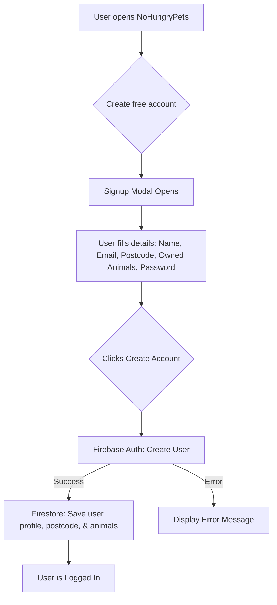

# NoHungryPets 🐾

**NoHungryPets** is a simple, free community website for sharing surplus pet food and supplies with people nearby — give what you can, take what you need.

- **Website**: `https://nohungrypets.co.uk`

## What’s in this repo

This repository hosts the **static frontend** (HTML/CSS/JS) for the NoHungryPets website.

## Setup Instructions

### Backend (Firebase)
To manage users and dynamic listings, this project is designed to integrate with Firebase:
1. Create a project in the [Firebase Console](https://console.firebase.google.com/).
2. Enable **Authentication** (Email/Password) to manage users.
3. Enable **Firestore Database** to store listings and user profiles.
4. Add your Firebase configuration keys to the `js/main.js` file (or a dedicated config file) using the Firebase Web SDK.

### Free Maps Integration
The map feature uses **Leaflet** combined with **OpenStreetMap** tile layers. 
- **No API keys are required.**
- It is completely free and open-source.
- The map initialization script is included at the bottom of the HTML files (e.g., `index.html` and `map.html`). 
- When generating real markers, fetch the coordinates from your Firestore database and plot them dynamically using Leaflet's `L.marker()` API.

### Image Hosting (Cloudinary)
To avoid the need for a credit card in Firebase, the platform uses **Cloudinary** for completely free image hosting (up to 25 GB).
- When a user posts a listing, the photos are automatically compressed on the client side using the HTML Canvas API.
- The photos are securely uploaded directly to Cloudinary using an **Unsigned Upload Preset**.
- The resulting image URLs are saved to the listing document in Firestore.

### Auto-Archiving
To keep the database clean, listings support an auto-archiving flow:
- When an item is taken, the owner marks it as **"Claimed"**.
- This applies a badge to the listing but leaves it visible for 24 hours.
- When the owner visits their Profile page, the app quietly checks all of their claimed listings in the background. If any have been claimed for more than 24 hours, the app auto-archives them to save space. (Note: Due to Cloudinary security limits, the images are kept in Cloudinary, but the tiny compressed files will take years to reach the 25 GB limit).

## Signup Flow Diagram

Here is a diagram illustrating the signup process and how it integrates with Firebase:

## License

See `LICENSE`.
