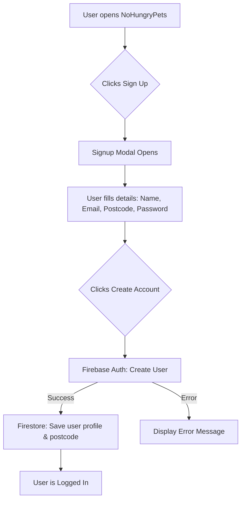

# NoHungryPets 🐾

**NoHungryPets** is a simple, free community website for sharing surplus pet food and supplies with people nearby — give what you can, take what you need.

- **Website**: `https://nohungrypets.co.uk`

## What’s in this repo

This repository hosts the **static frontend** (HTML/CSS/JS) for the NoHungryPets website.

## Setup Instructions

### Backend (Firebase)
To manage users and dynamic listings, this project is designed to integrate with Firebase:
1. Create a project in the [Firebase Console](https://console.firebase.google.com/).
2. Enable **Authentication** (Email/Password) to manage users.
3. Enable **Firestore Database** to store listings and user profiles.
4. Add your Firebase configuration keys to the `js/main.js` file (or a dedicated config file) using the Firebase Web SDK.

### Free Maps Integration
The map feature uses **Leaflet** combined with **OpenStreetMap** tile layers. 
- **No API keys are required.**
- It is completely free and open-source.
- The map initialization script is included at the bottom of the HTML files (e.g., `index.html` and `map.html`). 
- When generating real markers, fetch the coordinates from your Firestore database and plot them dynamically using Leaflet's `L.marker()` API.

## Signup Flow Diagram

Here is a diagram illustrating the signup process and how it integrates with Firebase:

## License

See `LICENSE`.
