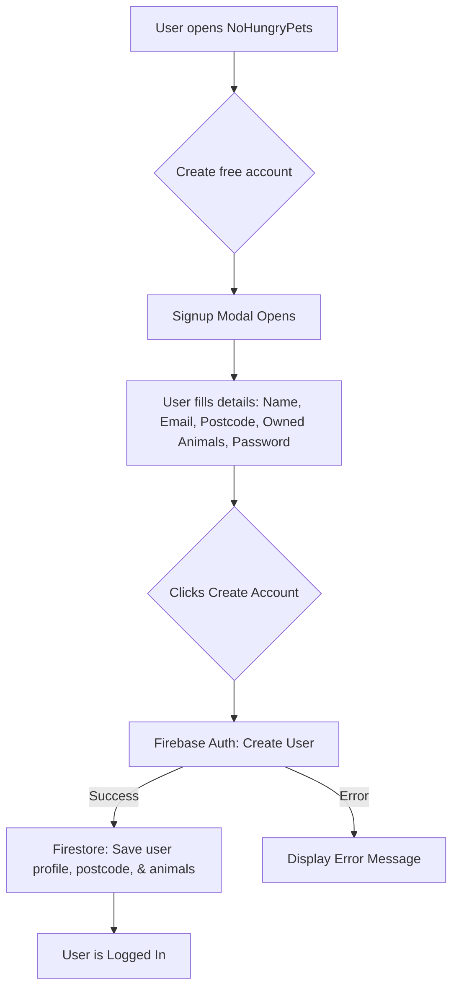

# NoHungryPets 🐾

**NoHungryPets** is a simple, free community website for sharing surplus pet food and supplies with people nearby — give what you can, take what you need.

- **Website**: `https://nohungrypets.co.uk`

## What’s in this repo

This repository hosts the **static frontend** (HTML/CSS/JS) for the NoHungryPets website.

## Setup Instructions

### Backend (Firebase)
To manage users and dynamic listings, this project is designed to integrate with Firebase:
1. Create a project in the [Firebase Console](https://console.firebase.google.com/).
2. Enable **Authentication** (Email/Password) to manage users.
3. Enable **Firestore Database** to store listings and user profiles.
4. Add your Firebase configuration keys to the `js/main.js` file (or a dedicated config file) using the Firebase Web SDK.

### Free Maps Integration
The map feature uses **Leaflet** combined with **OpenStreetMap** tile layers. 
- **No API keys are required.**
- It is completely free and open-source.
- The map initialization script is included at the bottom of the HTML files (e.g., `index.html` and `map.html`). 
- When generating real markers, fetch the coordinates from your Firestore database and plot them dynamically using Leaflet's `L.marker()` API.

### Image Hosting (Cloudinary)
To avoid the need for a credit card in Firebase, the platform uses **Cloudinary** for completely free image hosting (up to 25 GB).
- When a user posts a listing, the photos are automatically compressed on the client side using the HTML Canvas API.
- The photos are securely uploaded directly to Cloudinary using an **Unsigned Upload Preset**.
- The resulting image URLs are saved to the listing document in Firestore.

### Auto-Archiving
To keep the database clean, listings support an auto-archiving flow:
- When an item is taken, the owner marks it as **"Claimed"**.
- This applies a badge to the listing but leaves it visible for 24 hours.
- When the owner visits their Profile page, the app quietly checks all of their claimed listings in the background. If any have been claimed for more than 24 hours, the app auto-archives them to save space. (Note: Due to Cloudinary security limits, the images are kept in Cloudinary, but the tiny compressed files will take years to reach the 25 GB limit).

## Marketing Automation

A free, zero-billing-account pipeline drafts Facebook posts (and the
occasional illustration) for the NoHungryPets Page and emails them to
`info.nohungrypets@gmail.com` for manual review — nothing is auto-posted. It
runs as a scheduled GitHub Actions workflow (Mon/Wed/Fri) using Gemini for
text/image generation and Resend for delivery. See
[`marketing-agent/script/README.md`](marketing-agent/script/README.md) for
how it works and how to configure it.

## Message Notifications

Members get an **email when someone messages them**, so replies to a claim
don't sit unseen. Like the marketing pipeline, it's a **free, no-billing-account**
scheduled GitHub Actions workflow (every ~10 minutes) — no Firebase Blaze plan
or Cloud Functions required. See
[`.github/message-notifier/`](.github/message-notifier/) and
[`.github/workflows/message-notifier.yml`](.github/workflows/message-notifier.yml).

How it works: the job reads Firestore with a Firebase **service account**
(admin access, so no security-rules change is needed), finds conversations
updated since the last run that still have unread messages, and emails each
affected member a summary via SMTP. A checkpoint in `_meta/messageNotifier`
ensures each message is emailed once, not on every run.

**One-time setup** — add these under **Settings → Secrets and variables → Actions**:

| Secret | What it is |
| --- | --- |
| `FIREBASE_SERVICE_ACCOUNT` | Full JSON of a Firebase service account key (Firebase Console → Project settings → Service accounts → *Generate new private key*) |
| `MAIL_USERNAME` | The sending email address (e.g. a Gmail address) |
| `MAIL_PASSWORD` | A Gmail **App Password** (requires 2-Step Verification), not the normal password |

Test on demand with **Actions → Message Notifier → Run workflow**. Note: email
goes out from `MAIL_USERNAME`, so Gmail's daily sending limits apply at scale.

## Automated PR Reviews

[CodeRabbit](https://coderabbit.ai) reviews every pull request automatically
(free forever for public repos, no billing account) — config in
[`.coderabbit.yaml`](.coderabbit.yaml). Complements the existing
[CodeQL](https://github.com/agapasieka/nohungrypets/security/code-scanning)
and [gitleaks](.github/workflows/gitleaks.yml) checks: CodeRabbit reviews
logic/style/simplification, CodeQL scans for vulnerability patterns, gitleaks
scans for accidentally committed secrets.

## Signup Flow Diagram

Here is a diagram illustrating the signup process and how it integrates with Firebase:

```mermaid
flowchart TD
    A[User opens NoHungryPets] --> B{Create free account}
    B --> C[Signup Modal Opens]
    C --> D[User fills details: Name, Email, Postcode, Owned Animals, Password]
    D --> E{Clicks Create Account}
    E --> F[Firebase Auth: Create User]
    F -->|Success| G[Firestore: Save user profile, postcode, & animals]
    G --> H[User is Logged In]
    F -->|Error| I[Display Error Message]
```

## License

See `LICENSE`.
